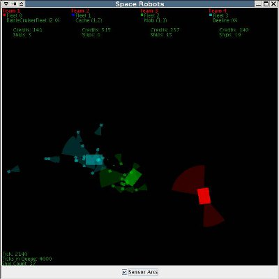

SpaceRobots is an AI programming space combat game written in Java.

----------------------------------------------------------------------

The latest (official) version of SpaceRobots can be obtained online at
https://github.com/bob5972/SpaceRobots.

This program requires BanackLib and jogl to run.

BanackLib can be obtained online at https://github.com/bob5972/BanackLib.
You'll need to stick this in your classpath when you run SpaceRobots.

Jogl can be obtained online at https://github.com/sgothel/jogl or
https://jogamp.org/jogl/www/ .

There are some vague installation directions buried in there, but basically
just stick jogl.jar and gluegen-rt.jar into your classpath.

You can build SpaceRobots with ant http://ant.apache.org/ using the supplied
build.xml file, or using your favorite java IDE (or by hand...), just make sure
you setup the classpath right.

----------------------------------------------------------------------

Once you've got it all setup, simply go java net.banack.spacerobots.SpaceRobots
and enjoy the fun!

Check out the sample fleets in net.banack.spacerobots.fleets to get started,
but basically you want to extend AIFleet, and go from there.

The AI interface is all done over a socket, so if you're really motivated you
can write your AI in whatever language you want.

Let me know if you get a good protocol written and I'll add it in.

Questions, Comments, !Complaints can be addressed to:

Michael Banack <github@banack.net>
